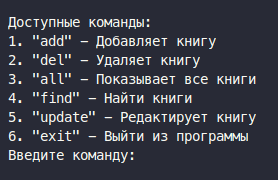

# test-job-effective-mobile

Задание: Разработка системы управления библиотекой

Описание
Необходимо разработать консольное приложение для управления библиотекой книг. Приложение должно позволять добавлять, удалять, искать и отображать книги. Каждая книга должна содержать следующие поля:
 • id (уникальный идентификатор, генерируется автоматически)
 • title (название книги)
 • author (автор книги)
 • year (год издания)
 • status (статус книги: “в наличии”, “выдана”)

Требования
 1 Добавление книги: Пользователь вводит title, author и year, после чего книга добавляется в библиотеку с уникальным id и статусом “в наличии”.
 2 Удаление книги: Пользователь вводит id книги, которую нужно удалить.
 3 Поиск книги: Пользователь может искать книги по title, author или year.
 4 Отображение всех книг: Приложение выводит список всех книг с их id, title, author, year и status.
 5 Изменение статуса книги: Пользователь вводит id книги и новый статус (“в наличии” или “выдана”).

Дополнительные требования
 • Реализовать хранение данных в текстовом или json формате.
 • Обеспечить корректную обработку ошибок (например, попытка удалить несуществующую книгу).
 • Написать функции для каждой операции (добавление, удаление, поиск, отображение, изменение статуса).
 • Не использовать сторонние библиотеки.

# Решение

Для реализации хранения в json файле реализованы структуры для работы с бд и сериализации / десериализации данных для сущностей.

## Структура хранения:

-- Entities - дата классы
   - Book

-- DataBase - абстрактный класс
   - DBManager - Управление для различных бд через стратегию 
   - JSONDataBase - конкретная реализация для json

-- Serializer - абстрактный класс
   - JsonSerializer - для сериализации объектов из дата классов в json
      - BookSerializer - для десериализации json в Book

Файл для хранения создаться автоматически

## Для визуальной составляющей консольного приложение создано 2 класса

-- Screen - класс с набором команд
  - Command - класс с методом execute, который исполняет команду пользователя и возвращает его на другой / этот же самый экран

## Как пользоваться:

Вводить нужно именно команду указанную в кавычках (не цифру!)
Следовать подсказкам в терминале
* При поиске или обновлении ввод пользователя преобразуется в валидный python словарь код. Писать его стоит без указания фигурных скобок "{ input() }"

P.S. Да, было бы проще создать доп класс Library, сделать его iterable, но об этом я уже подумал позже :)

